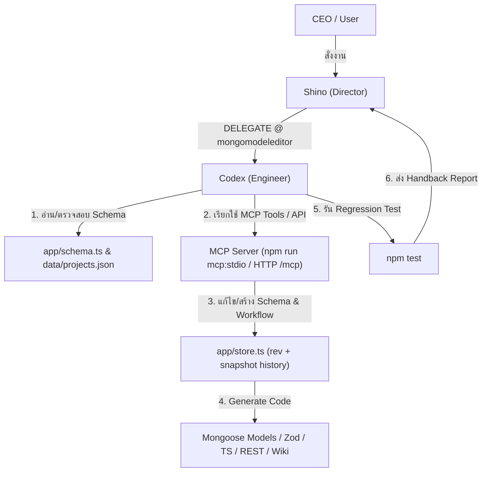

# 🍃 คู่มือการใช้งาน mongomodeleditor สำหรับ AI Agent ใน Bagidea Office

เอกสารฉบับนี้อธิบายสถาปัตยกรรม วิธีการทำงาน และการบูรณาการระบบ **[mongomodeleditor](https://github.com/jaturapornchai/mongomodeleditor)** ร่วมกับ **AI Agent** ใน **Bagidea Office**

---

## 1. ภาพรวมระบบ (System Overview)

**mongomodeleditor** คือเครื่องมือ Visual Schema & Workflow Designer พัฒนาด้วย **Next.js 16, React 19, TypeScript strict, React Flow, ELK layout, Babylon.js, Tailwind CSS 4, Zod 4 และ MCP SDK (1.30+)**

### ความสามารถหลัก (Core Capabilities)
1. **Visual Schema Designer**:
   - ออกแบบ Collection, Field, Index และความสัมพันธ์ (embed/reference, self-reference, enum, unique, `Array<Object>`, Decimal128)
   - มีระบบ Lint & Validator ในตัว
   - มี Code Generators สำหรับสร้าง Mongoose Models, Zod Validation Schemas, TypeScript Types, Next.js REST API Routes, Seeders และ Wiki Documentation (`app/wiki/[project]/`)
2. **Workflow Engine & Visual Editor**:
   - ออกแบบลำดับการทำงาน (Workflow) แบบ Graph-based ด้วย React Flow + ELK Auto-layout
   - Node types: Trigger, Action, Condition, Transform
   - มีโหมด 3D Navigation View พัฒนาด้วย Babylon.js (`app/workflow-3d/viewer.tsx`, `app/workflow-3d/world.ts`)
3. **AI Agent & MCP Integration**:
   - มี MCP Server ในตัว (`app/mcp/server.ts`, `app/mcp/route.ts`) รองรับการเชื่อมต่อของ AI Agent ทั้งผ่าน `stdio` (`npm run mcp:stdio`) และ HTTP (`/mcp`)
4. **Data Storage & Sync**:
   - เก็บข้อมูลหลักที่ `data/projects.json` พร้อมระบบ Optimistic Concurrency Control ผ่านค่า `rev` (revision)
   - บันทึก History Snapshots อัตโนมัติสูงสุด 20 รุ่นใน `data/history/`
   - มีตัวอย่าง ERP System สมบูรณ์ในตัว (`erp-example.json`) ประกอบด้วย 5 โมดูล 16 collections และ 116 fields

---

## 2. โครงสร้างไฟล์และจุดสืบค้นหลัก (Key Code Locations)

| ส่วนงาน | ไฟล์หลัก | หน้าที่สำคัญ |
|---|---|---|
| **Visual Designer & Project Home** | `app/page.tsx` | หน้า UI สำหรับจัดการ Project และออกแบบ Schema |
| **Schema Types, Lint & Codegen** | `app/schema.ts` | Data Models, Validation Logic และ Code Generators (Mongoose, Zod, TS, REST routes) |
| **Workflow Model & Export** | `app/workflow.ts` | Data Structure และ Logic ของ Workflow |
| **Workflow Visual Editor** | `app/workflow-editor.tsx` | React Flow Editor สำหรับลากวาง Node Workflow |
| **Workflow Auto-layout (ELK)** | `app/workflow-layout.ts` | ระบบจัดระเบียบตำแหน่ง Node อัตโนมัติด้วย ELK |
| **Workflow 3D View & Babylon.js** | `app/workflow-3d/viewer.tsx` | โหมดแสดงผล Workflow แบบ 3 มิติ |
| **Project Store & History Sync** | `app/store.ts` | จัดการ `data/projects.json`, Revision Control (`rev`) และ Snapshot History |
| **Workflow REST API** | `app/api/projects/[name]/workflows/route.ts` | REST Endpoint สำหรับอ่าน/บันทึก Workflow |
| **MCP Tools Implementation** | `app/mcp/server.ts` | ฟังก์ชัน Tools สำหรับให้ AI Agent เรียกใช้ |
| **MCP HTTP Transport** | `app/mcp/route.ts` | Endpoint `/mcp` สำหรับรับคำสั่ง MCP ผ่าน HTTP |
| **Wiki Viewer** | `app/wiki/[project]/` | หน้าแสดงเอกสารวิกิของ Schema |

---

## 3. คำสั่งพัฒนาและทดสอบ (Developer Commands)

| คำสั่ง | วัตถุประสงค์ |
|---|---|
| `npm run dev` | เริ่ม Dev Server ที่พอร์ต `http://localhost:3100` |
| `npm test` | รัน Regression Tests ของ Schema, Workflow, Codegen, Lint |
| `npm run lint` | ตรวจสอบ ESLint |
| `npm run build` | สร้าง Production Build |
| `npm run mcp:stdio` | รัน MCP Transport ผ่าน stdio สำหรับ AI Client |
| `npm run docker:up` | Build & รัน Production Container |

---

## 4. ขั้นตอนการทำงานของ AI Agent (AI Agent Workflow)

เมื่อ AI Agent (เช่น `Shino`, `Codex`, `Kwin`, `Metha`) ได้รับมอบหมายงานเกี่ยวกับ `mongomodeleditor` ใน Bagidea Office:

### ขั้นตอนปฏิบัติการของ Agent:
1. **ตรวจสอบความต้องการและ Schema ปัจจุบัน**: อ่าน `data/projects.json` หรือเรียกผ่าน MCP tool เพื่อดูโครงสร้าง Collection และ Workflow เดิม
2. **ปรับแต่ง Schema & Code Generation**: ใช้ `app/schema.ts` เพื่อสร้างหรืออัปเดต Field, Validation และ Indexes
3. **ตรวจสอบ Concurrency Control**: ตรวจสอบค่า `rev` ก่อนบันทึกการเปลี่ยนแปลง ป้องกันปัญหาการเขียนทับข้อมูลซ้ำซ้อน
4. **สร้าง Code & Documentation Deliverables**: สั่ง Generate Mongoose Models, Zod validation schemas, TypeScript interfaces และ REST routes
5. **ทดสอบความถูกต้อง**: รันคำสั่ง `npm test` และ `npm run lint` เพื่อยืนยันว่าโค้ดไม่มี Error ก่อนส่ง Handback Report กลับยัง Director

---

## 5. ความปลอดภัยและข้อระวัง (Security & Constraints)

- **Authentication**: ตัวแอป `mongomodeleditor` ตั้งใจให้ใช้ใน Local Environment ไม่มีระบบ Auth ในตัว
- **MCP Endpoint Security**: Endpoint `/mcp` มีการตรวจเช็ค `Origin` เพื่อป้องกัน CSRF แต่ไม่ควรเปิดเผยพอร์ต `3100` ออกอินเทอร์เน็ตสาธารณะโดยตรง
- **Data Backup**: ข้อมูลหลักอยู่ที่ `data/projects.json` การย้ายเครื่องหรือ backup สามารถคัดลอกไฟล์นี้หรือโฟลเดอร์ `data/history/` ได้ทันที
